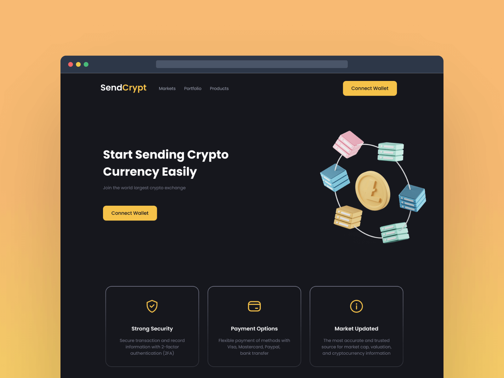

## sections (6)

- header
- hero
- features
- contact
- transactions
- footer

## Experience

- `neutral color`: màu trung tính, ko nổi bật đc dùng làm màu nền, elements không làm xao lạc hoặc gây mất cân đối với các màu sắc khác trong thiết kế.

```sh
32 lg
44 xl heading
20 md
16 base
18 sm
14 xs
```



**Challenge Title**
SendCrypt Web3 App

**Challenge Description**
In this challenge, you'll build a SendCrypt Web3 App. This challenge is perfect for you if you've been learning Web3 and want to take your Web3 skills to the next level by building a real-world project.

**Difficulty Level**
Beginner

**Tags**
WEB 3.0

**Learning**
You'll practice how to write smart contracts using Web 3 Technologies like Solidity to make transactions on Blockchain and how to integrate Web 3 wallets like Metamask. Did we mention it's also super fun?

**Requirements**

- Connect a Metamask wallet.
- See the connected account.
- Make transactions on Blockchain.
- Send GIF and message.
- See the latest transactions.
- See the hover state of all the elements.

I hope you'll enjoy building this challenge.

Feel free to share your solution on the website or on social media and tag [us](https://twitter.com/codingspace30).
